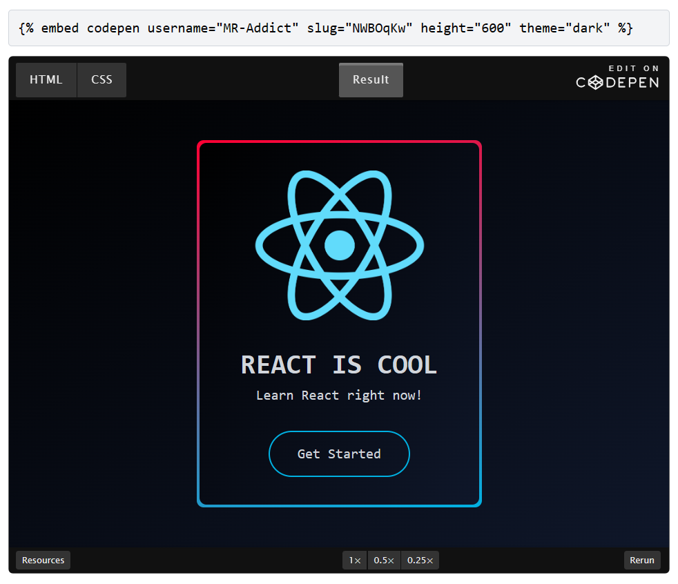

# Mdbook Embedify

 

This is a [mdbook](https://rust-lang.github.io/mdBook) preprocessor plugin that allows you to embed apps to your book.

## 1. Installation

First, you need to install mdbook-embedify to your computer.You can install it from crates.io using cargo.

```sh
cargo install mdbook-embedify
```

After installation, add the following code to your `book.toml` file:

```toml
[preprocessor.embedify]
```

## 2. Usage

Then you can use `embed` macro to embed an app. The syntax is like this:

```text

```

**options** are key-value based array seperated by space and its value must be wrapped by quotes. For example:

```text

```

## 3. Examples



You can see a live demo and more detailed documentation [here](https://mr-addict.github.io/mdbook-embedify).
